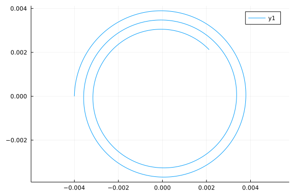

# Spiral2D
A simple module modeling two-dimensional spirals.
While usable with plain `Number`s, all functions accept `Unitful` units.

## Installation
```julia
using Pkg
Pkg.add("https://github.com/mechanomy/Spiral2D.jl.git")

```
## Usage
```julia
using Spiral2D
using Unitful

s = Spiral(a0=45u"°", a1=900u"°", r0=3u"mm", r1=4u"mm") #a counterclockwise spiral starting at r0=3mm and a0=45deg, terminating at r1=3mm and a1=900deg, with 0.5 

calcPitch(s) # = 1.169e-3 mm/°
calcPitch(s)*360 # = 0.42 mm/rev

calcLength(s) # = 52.34mm

isCounterClockwise(s) # = true
isClockwise(s) # = false
isIncreasing(s) # = true
isDecreasing(s) # = false

(xs,ys) = seriesCartesian(s, 100)
(as,rs) = seriesPolar(s, 100)
```

See [test/runtests.jl](test/runtests.jl) for additional usage examples.

## Plotting
```julia
using Spiral2D
using Plots

s = Spiral(a0=45u"°", a1=900u"°", r0=3u"mm", r1=4u"mm", pitch=0.5u"mm/rad") # counterclockwise spiral starting at r0=3mm and a0=45deg, terminating at r1=3mm and a1=900deg, with 0.5 
(xs,ys) = seriesCartesian(s, 1000)
plot( ustrip.(u"mm", xs), ustrip.(u"mm", ys), aspect_ratio=:equal )
```



## Copyright
Copyright (c) 2022 Mechanomy LLC.

Released under the [MIT license](license.md).
